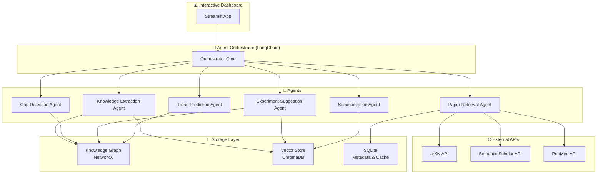

# ResearchAI – Architecture Documentation

## System Overview

ResearchAI is a **multi-agent autonomous research assistant** built as a modular pipeline system. Each agent handles a specific research task, and the **Agent Orchestrator** coordinates them in configurable pipelines.

### System Architecture Diagram



## Architecture Layers

### 1. Presentation Layer (Dashboard)
- **Technology:** Streamlit with Plotly and PyVis
- **Pages:** Home, Paper Explorer, Knowledge Graph, Gap Analysis, Experiment Lab, Trend Forecast
- **Design:** Dark theme with glassmorphism UI, responsive layout

### 2. Orchestration Layer
- **`AgentOrchestrator`** manages agent lifecycles and data flow
- **Pipeline modes:**
  - `full` — All 6 agents in sequence
  - `summary_only` — Paper Retrieval → Summarization
  - `gaps_only` — Gap Detection → Experiment Suggestion (uses existing graph)
  - `trends_only` — Trend Prediction (uses existing graph)

### 3. Agent Layer
Each agent extends `BaseAgent` and implements `process()`:

| Agent | Input | Output | Key Logic |
|-------|-------|--------|-----------|
| PaperRetrieval | Query string | List[Paper] | Multi-API fetch with caching |
| KnowledgeExtraction | List[Paper] | Entities + Relations | NLP extraction, KG population |
| GapDetection | KnowledgeGraph | List[ResearchGap] | 4-strategy graph analysis |
| ExperimentSuggestion | List[ResearchGap] | List[ExperimentSuggestion] | RAG + template generation |
| Summarization | List[Paper] | List[PaperSummary] | BART-CNN abstractive |
| TrendPrediction | KnowledgeGraph | List[TrendPrediction] | Temporal analysis + smoothing |

### 4. Storage Layer
- **Knowledge Graph** (NetworkX) — Papers, authors, topics, methods, datasets connected by typed edges
- **Vector Store** (ChromaDB) — Paper embeddings for semantic search and RAG
- **Cache** (JSON files) — API response caching to minimize external calls

## Data Flow

```
Query → PaperRetrieval → Papers
     → KnowledgeExtraction → KG Nodes + VectorStore Embeddings
     → GapDetection (reads KG) → Gaps
     → ExperimentSuggestion (reads Gaps + VectorStore) → Experiments
     → Summarization (reads Papers) → Summaries
     → TrendPrediction (reads KG temporal data) → Predictions
```

## Gap Detection Strategies

1. **Sparse Regions** — Topics with below-average paper connections
2. **Method-Dataset Gaps** — Untested method+dataset combinations
3. **Stagnating Topics** — Topics with declining recent activity
4. **Isolated Clusters** — Small disconnected communities in the graph

## Trend Prediction Metrics

1. **Citation velocity** — Year-over-year citation acceleration
2. **Topic growth rate** — Linear regression of papers/year
3. **Recency score** — Proportion of recent papers
4. **Author diversity** — Number of unique researchers
5. **Volume signal** — Total paper count for reliability

Confidence score = weighted combination of all 5 signals, projected via exponential smoothing.
